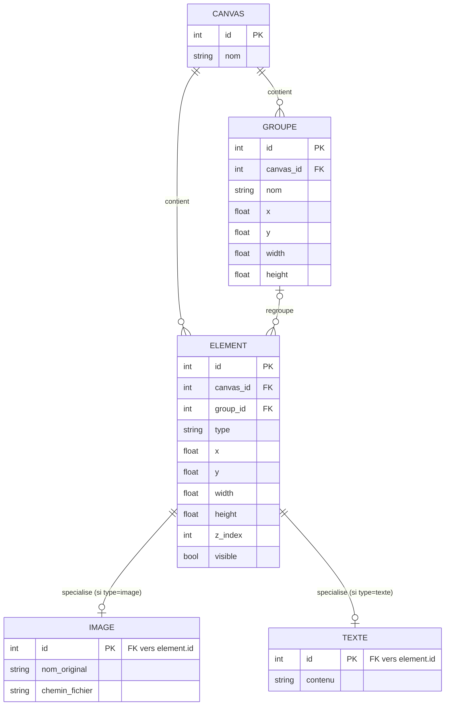

# Schéma entité-association

Reflète la décision d'héritage à tables jointes (voir `decisions.md`) : `ELEMENT` porte les champs communs à tout ce qui peut être posé sur un canevas, `IMAGE` et `TEXTE` n'ajoutent que leurs champs propres via une clé étrangère 1-pour-1 vers `ELEMENT`.

## Notes de lecture

Un `ELEMENT` n'a jamais à la fois une ligne `IMAGE` et une ligne `TEXTE` associée : la colonne `type` sur `ELEMENT` (le discriminant polymorphique SQLAlchemy) garantit l'exclusivité, ce que le diagramme seul ne peut pas exprimer.

`group_id` est nullable : un élément peut exister sans appartenir à aucun groupe.

Constructions actuelles du MVP : `CANVAS` (un seul enregistrement, sans interface de sélection) et `ELEMENT`/`IMAGE`. `GROUPE` et `TEXTE` sont modélisés mais sans route API ni interface pour l'instant (voir `roadmap.md`).