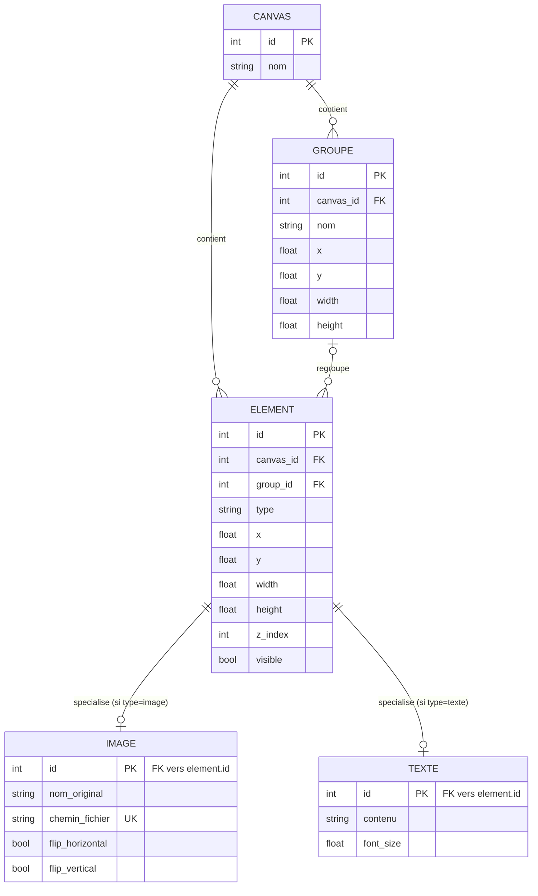

# Schéma entité-association

Reflète la décision d'héritage à tables jointes (voir `decisions.md`) : `ELEMENT` porte les champs communs à tout ce qui peut être posé sur un canevas, `IMAGE` et `TEXTE` n'ajoutent que leurs champs propres via une clé étrangère 1-pour-1 vers `ELEMENT`.

```mermaid
erDiagram
    CANVAS ||--o{ ELEMENT : contient
    CANVAS ||--o{ GROUPE : contient
    GROUPE o|--o{ ELEMENT : regroupe
    ELEMENT ||--o| IMAGE : "specialise (si type=image)"
    ELEMENT ||--o| TEXTE : "specialise (si type=texte)"

    CANVAS {
        int id PK
        string nom
    }

    GROUPE {
        int id PK
        int canvas_id FK
        string nom
        float x
        float y
        float width
        float height
    }

    ELEMENT {
        int id PK
        int canvas_id FK
        int group_id FK
        string type
        float x
        float y
        float width
        float height
        int z_index
        bool visible
    }

    IMAGE {
        int id PK "FK vers element.id"
        string nom_original
        string chemin_fichier UK
        bool flip_horizontal
        bool flip_vertical
    }

    TEXTE {
        int id PK "FK vers element.id"
        string contenu
        float font_size
    }
```

## Notes de lecture

Un `ELEMENT` n'a jamais à la fois une ligne `IMAGE` et une ligne `TEXTE` associée : la colonne `type` sur `ELEMENT` (le discriminant polymorphique SQLAlchemy) garantit l'exclusivité, ce que le diagramme seul ne peut pas exprimer.

`group_id` est nullable : un élément peut exister sans appartenir à aucun groupe.

`chemin_fichier` est unique : deux éléments ne peuvent pas pointer le même fichier. C'est ce qui empêche aujourd'hui de dupliquer un élément sans recopier son fichier (ticket `ELM-01`).

`font_size` est stocké explicitement et la hauteur du cadre en découle : avec le retour à la ligne, le nombre de lignes dépend de la police et de la largeur, donc la hauteur ne peut pas déterminer la police.

État au 27 septembre : `ELEMENT`, `IMAGE` et `TEXTE` sont implémentés de bout en bout (modèle, routes, interface). `CANVAS` existe avec un seul enregistrement et sans interface de sélection ; `GROUPE` est modélisé mais sans route ni interface (spécifié mais non implémenté).